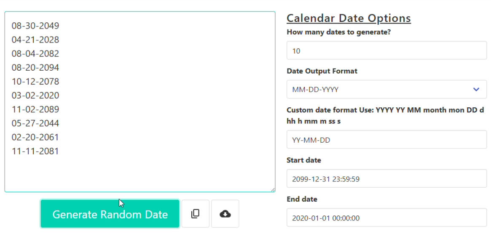

# BUG-02: End date earlier than start date is accepted without a warning

- **Severity: Low.** The dates still fall between the two dates entered, so the output isn't wrong. The tool just doesn't flag the mistake.
- **Priority: Low.** Worth fixing with the other validation issues, but not urgent on its own.

## Environment

- Page: https://codebeautify.org/generate-random-date
- Browser: Opera GX 136.0.6008.76
- OS: Windows 11 Home
- Device: Desktop PC
- Date tested: 7 October 2026

## Preconditions

Page freshly loaded, all settings at default (count 10, format MM-DD-YYYY).

## Steps to reproduce

1. Clear the "Start date" box and type `2099-12-31 23:59:59`.
2. Clear the "End date" box and type `2020-01-01 00:00:00`.
3. Click "Generate Random Date".

## Expected result

A message such as "End date must be after start date", and no dates generated. Another acceptable result: the tool swaps the two dates and tells the user it did.

## Actual result

10 dates were generated with no message:

```
08-30-2049
04-21-2028
08-04-2082
08-20-2094
10-12-2078
03-02-2020
11-02-2089
05-27-2044
02-20-2061
11-11-2081
```

## Evidence



Video: [BUG-02-end-date-before-start-date.mp4](../evidence/BUG-02-end-date-before-start-date.mp4)

## Reproducibility

Every time I tried.

## Notes

- **Suspected cause:** the tool never checks which date comes first. It picks dates between the two values either way, so the output still looks normal.
- **Why it matters:** if a user swaps the dates by mistake, nothing tells them. Most forms with a date range catch this.
- **Suggested fix:** check that the end date is after the start date before generating.
