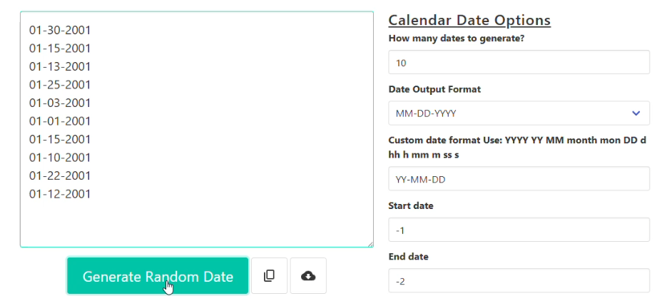

# BUG-03: Date boxes accept invalid dates and generate wrong results without an error

- **Severity: Medium.** The tool produces wrong dates and gives no sign that anything is off.
- **Priority: Medium.** A simple typo gives the user a full list of believable but wrong dates, and they have no reason to doubt it.

## Environment

- Page: https://codebeautify.org/generate-random-date
- Browser: Opera GX 136.0.6008.76
- OS: Windows 11 Home
- Device: Desktop PC
- Date tested: 7 October 2026

## Preconditions

Page freshly loaded, all settings at default (count 10, format MM-DD-YYYY).

## Steps to reproduce

1. Clear the "Start date" box and type `-1`.
2. Clear the "End date" box and type `-2`.
3. Click "Generate Random Date".

## Expected result

An error message like "Please enter a valid date (YYYY-MM-DD hh:mm:ss)", and no dates generated. `-1` and `-2` are not dates.

## Actual result

10 dates from January 2001 were generated, with no message:

```
01-30-2001
01-15-2001
01-13-2001
01-25-2001
01-03-2001
01-01-2001
01-15-2001
01-10-2001
01-22-2001
01-12-2001
```

Other invalid inputs gave wrong results in the same way:

| Start date | End date | Result |
|---|---|---|
| `1` | `1` | `01-01-2001` on every line |
| `-1` | `-1` | `01-01-2001` on every line |
| `2020-02-30 00:00:00` | `2020-02-30 00:00:00` | `03-01-2020` on every line (February 30 became March 1) |

## Evidence



Video: [BUG-03-invalid-dates-accepted.mp4](../evidence/BUG-03-invalid-dates-accepted.mp4)

## Reproducibility

Every time I tried.

## Notes

- **Suspected cause:** the tool doesn't check whether the text is a real date. It passes the text to the browser, and the browser guesses. It reads `-1` as January 2001 and `-2` as February 2001. It rolls February 30 over to March 1. You can see the guessing by typing `new Date("-1")` into the browser's DevTools Console.
- **Why it matters:** the output looks normal. Someone who made a typo would use wrong test data without knowing.
- **Suggested fix:** check that both boxes hold a real date in the expected format, and show an error if they don't. Another option is a date picker, which only allows real dates.
