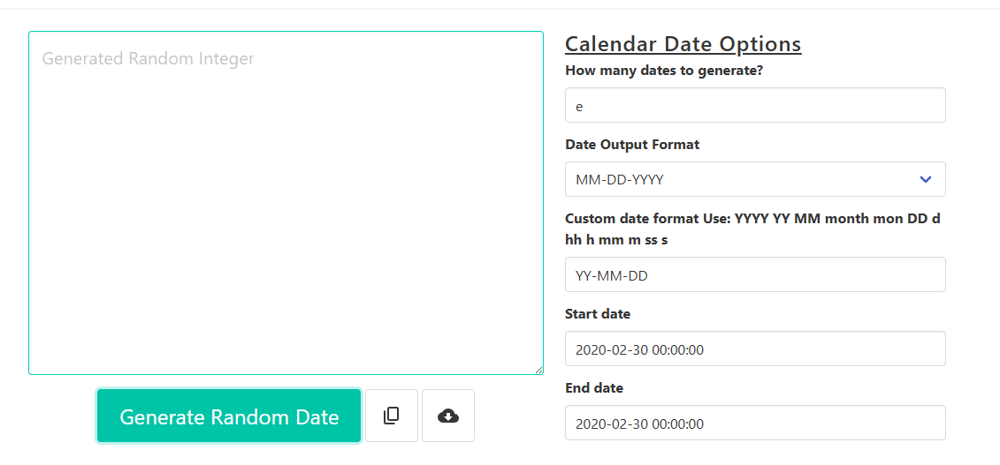

# BUG-04: Count box accepts the letter "e" and shows an empty result with no message

- **Severity: Low.** No wrong data is produced. The user just gets an empty box and no explanation.
- **Priority: Medium.** It's confusing, and the same gap lets exponent numbers like `1e2` through, which ties into the freeze in BUG-01.

## Environment

- Page: https://codebeautify.org/generate-random-date
- Browser: Opera GX 136.0.6008.76
- OS: Windows 11 Home
- Device: Desktop PC
- Date tested: 7 October 2026

## Preconditions

Page freshly loaded, all settings at default.

## Steps to reproduce

1. Click the "How many dates to generate?" box.
2. Delete `10`.
3. Type `e`.

## Expected result

The letter is blocked, or a message appears, such as "Please enter a whole number".

## Actual result

- The box accepts `e`. Other letters are blocked.
- The output box goes empty and shows only its grey placeholder text, "Generated Random Integer".
- No error or message appears.
- The same thing happens with a capital `E`.
- `1e2` is accepted and read as 100, so 100 dates are generated.

## Evidence

## Reproducibility

Every time I tried.

## Notes

- **Suspected cause:** the count box is a number field. Browsers allow `e` in number fields because it's used for exponent numbers like `1e2` (meaning 1 × 10²). Allowing it is normal browser behaviour. The real problem is that the site never checks the value or tells the user what went wrong.
- **Related:** [BUG-01](BUG-01-page-freezes-on-large-count.md). Exponent numbers make it easy to ask for a huge count by accident. For example, `1e7` means 10 million.
- **Suggested fix:** accept whole numbers only, set a minimum and a maximum, and show a message for anything else.
- **Side note:** the placeholder text says "Generated Random Integer" on a date tool. It looks like it was copied from another tool and never updated.
